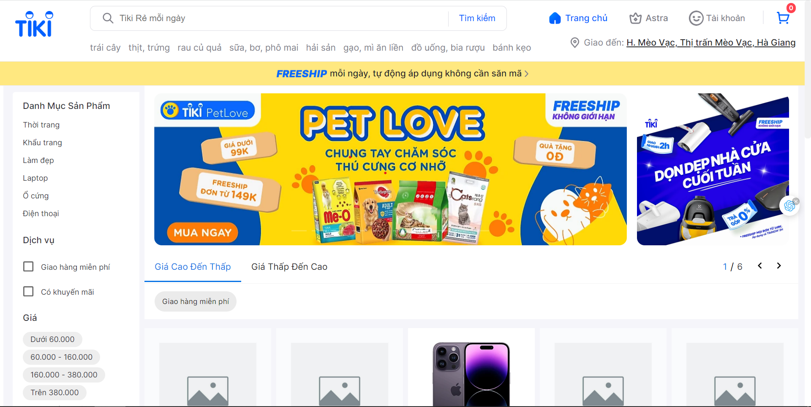
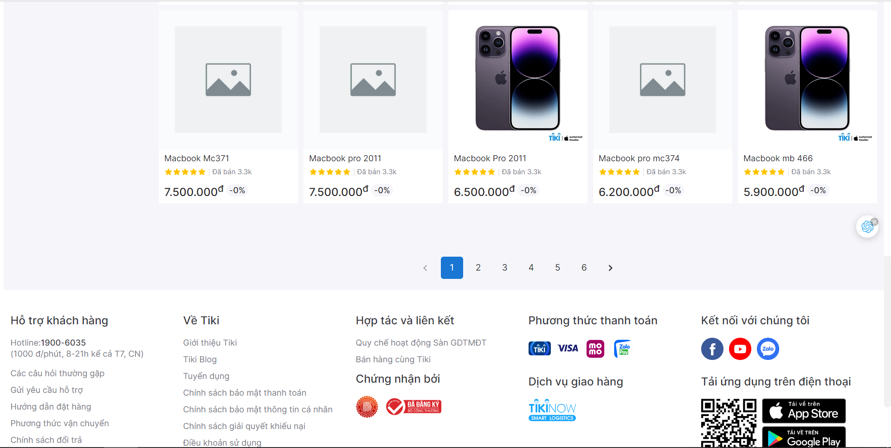
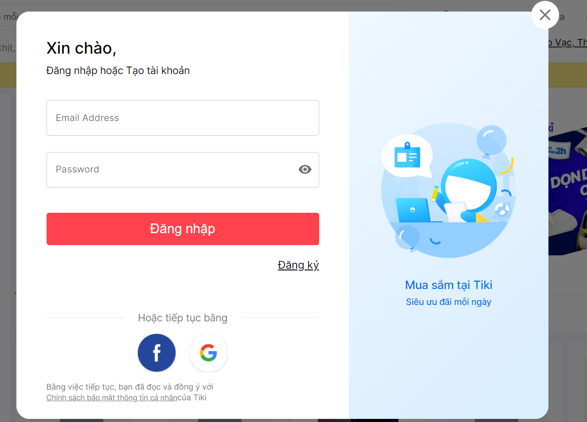
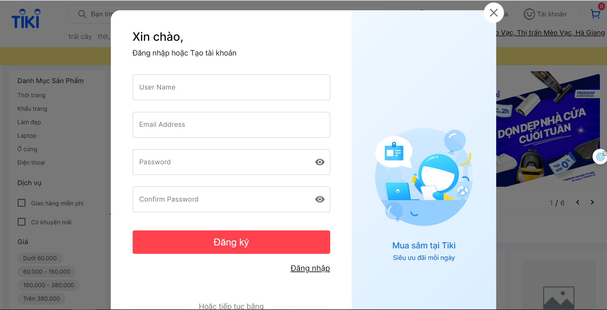
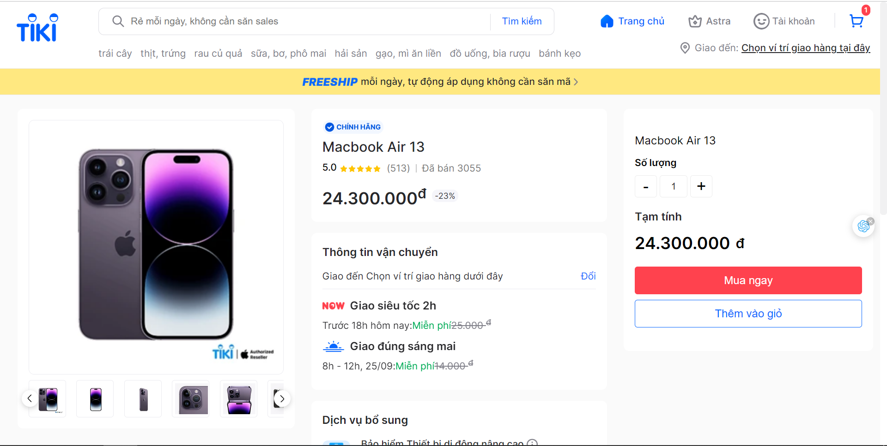
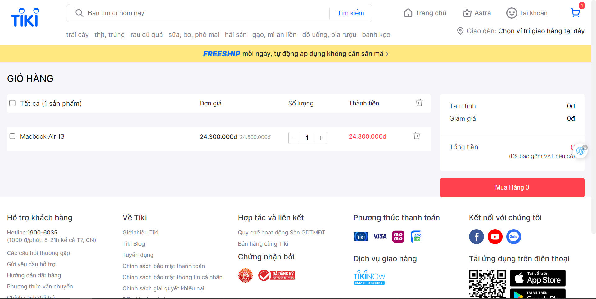
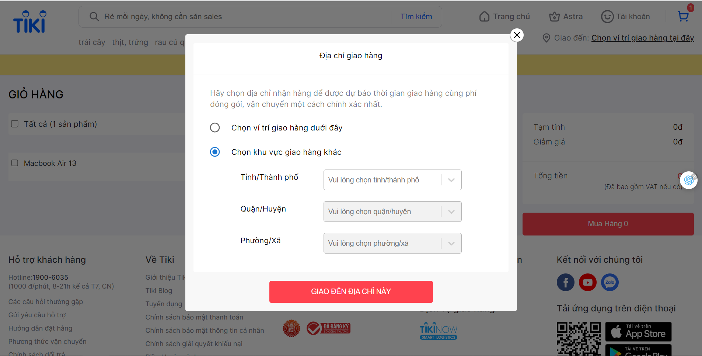

🚀 Deploy: https://tiki-zeta.vercel.app

⚙️ Technologies:

-   ReactJS
-   TypeScript
-   Sass
-   JavaScript

🕹️ Features:

-   Login, register, logout
-   Skeleton loading
-   Cart
-   Show and Filters products
-   Location
-   Responsive (Mobile is developing according to style adaptive web design )

UI

-   Home.
    
    

-   Login.
    

-   Register.
    

-   Detail Product
    

-   Cart.
    

-   Location
    

# Set up

1. Clone my repositories

```
git clone https://github.com/nguyentiendat05122003/TiKi.git
cd TiKi
```

2. Install the required packages

```
npm install
```

3. Build the application:

```
npm run build
```

4. Start the development:

```
npm run dev
```
